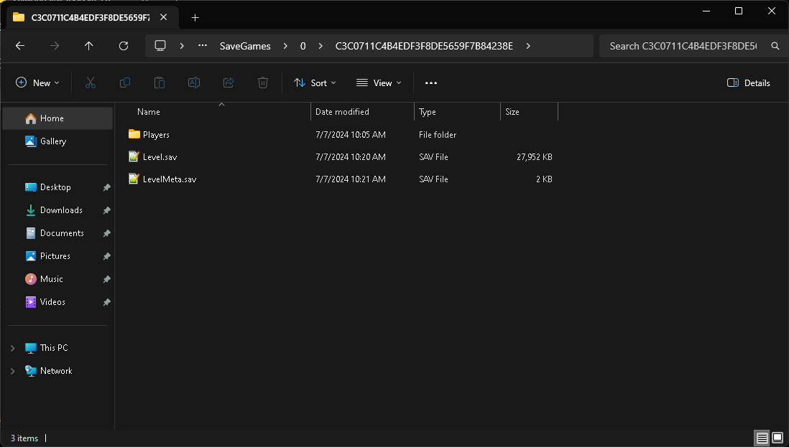
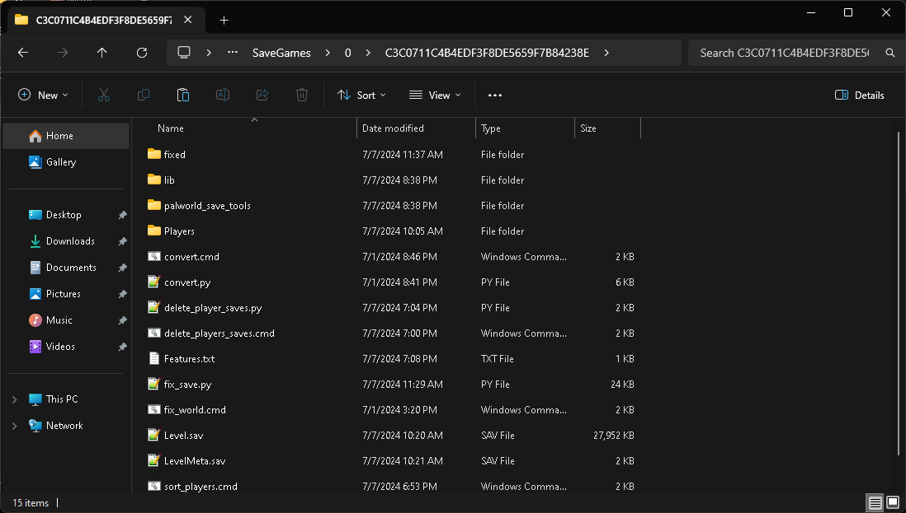

# PalWorldSaveTools

# Working as of v0.3.12 patch.

- **Author:** MagicBear and cheahjs 
- **License:** MIT License  
- **Updated by:** Pylar and Techdude  
- **Map Pictures Provided by:** Kozejin 
- **Testers/Helpers:** Lethe and Choi-Jungwoo

## Remember to use `clean_up.cmd` after every update for the best performance!

## Important Python Installation Note
- Please make sure to use the official version of Python via [python.org/downloads](https://www.python.org/downloads), NOT the WindowsApps version of Python. Otherwise, you may encounter issues due to downloading and installing packages. 
- If you encounter any issues even after using the official version of Python, please install the Visual C++ Redistributable AIO from:  
[Visual C++ Redistributable AIO](https://github.com/abbodi1406/vcredist/releases).
- If the cityhash hasn't been installed for some reason, likely C++ not working/broken/etc: You might have to download [VS build tools](https://visualstudio.microsoft.com/visual-cpp-build-tools/).
- If that fails, you may try my pre-compiled version of cityhash package [here](https://www.dropbox.com/scl/fi/dbz4zikmmqawpbo56a7d0/external_libs.zip?rlkey=xf6vz30qlmxrpgpr1aw2117p8&st=4oec5601&dl=1).

### Installation Directions for AIO
1. Download **VisualCppRedist_AIO_x86_x64.exe** from the link above.
2. Run the downloaded file and follow the prompts to complete the installation.
3. After installation, use `clean_up.cmd` and try again.

## Current Features
- **Fast parsing/reading tool**—one of the quickest out there.
- Fixes the 40k pal limit by parsing out inactive pals. **(OBSOLETE, OFFICIALLY FIXED ON 22nd August 2024)**
- Fixes the left mouse bug.
- Lists all players/guilds.
- Lists all pals (All/Deleted/Kept).
- Shows last online time for players.
- Logs players and their relevant information into `players.log`.
- Sorts and deletes players based on level and last online time.
- Logs and sorts players by the number of pals they own.
- Deletes players based on the number of pals.
- Automatically downloads and installs required assets (images/fonts) into the `internal_libs` folder.
- Automatically downloads and installs required libraries (packages) into the `external_libs` folder.
- Automatically downloads and installs the missing `palworld_save_tools` folder (no progress bar and might show "errors" but still usable).
- Allows testing in a Linux environment via `fix_save.sh` and `fix_world.sh`.
- Enables drag-and-drop functionality for world versions of files.
- Enables double-click functionality for save versions of files.
- Provides a base map view through `bases.cmd`.
- Transfers saves between dedicated server and single/coop world.
- Look up the palworld id via steam id by convertids.

## Transferring Local Saves to Server
_read the fix_host_save_readme.txt for instructions and make sure to check the fix_host_save_screenshots for clear images on how to do the instructions properly_
- Make sure to disable private locks on the "host" chests.
- If you are trying to use GamePass saves(Xbox Platform), make sure to use XPG save extractor then convert it to json. Then reconvert json back to Level.sav. Then use the tool.

## How to Automatically Delete Player Saves Based on Inactivity
1. Copy everything from your server (`\Pal\Saved\SaveGames\0\RANDOMSERVERID\`) into the same location within the tool (`PalworldSaveTools\`).
2. Run `fix_save.cmd`.
3. Run `sort_players.cmd` and/or `delete_pals_save.cmd`.
4. Copy the `Players` folder from the tool.
5. Delete the original `Players` folder from the server (`\Pal\Saved\SaveGames\0\RANDOMSERVERID\`).
6. Paste the copied `Players` folder into the server folder.
7. Profit?

## Additional Notes
- **Days:** Tracks players inactive for a specified number of days (e.g., 30 days and older).
- **Level:** Tracks players up to a specified level (e.g., level 30 or lower).
- **Pals:** Deletes players based on the number of pals (e.g., 10 or fewer pals).
- The fixed save (`PalworldSaveTools\fixed\Level.sav`) is no longer functional after patch v0.3+.
- As of update v0.5.5, you can view the total number of pals caught/owned. To do so, copy the server's `Players` folder into the tool's `Players` folder.

